# ML Application Architecture — DS Service Platform (Mermaid)

> สถาปัตยกรรมของ ML Application ทั้ง 2 โปรเจกต์ เมื่อต่อ Dataiku DSS เรียบร้อยแล้ว
>
> **วิธีดู:** เปิดใน GitHub, Notion, VSCode (Markdown Preview Mermaid Support extension), หรือ [mermaid.live](https://mermaid.live)

---

## 1. System Landscape — ภาพรวมทั้งระบบ

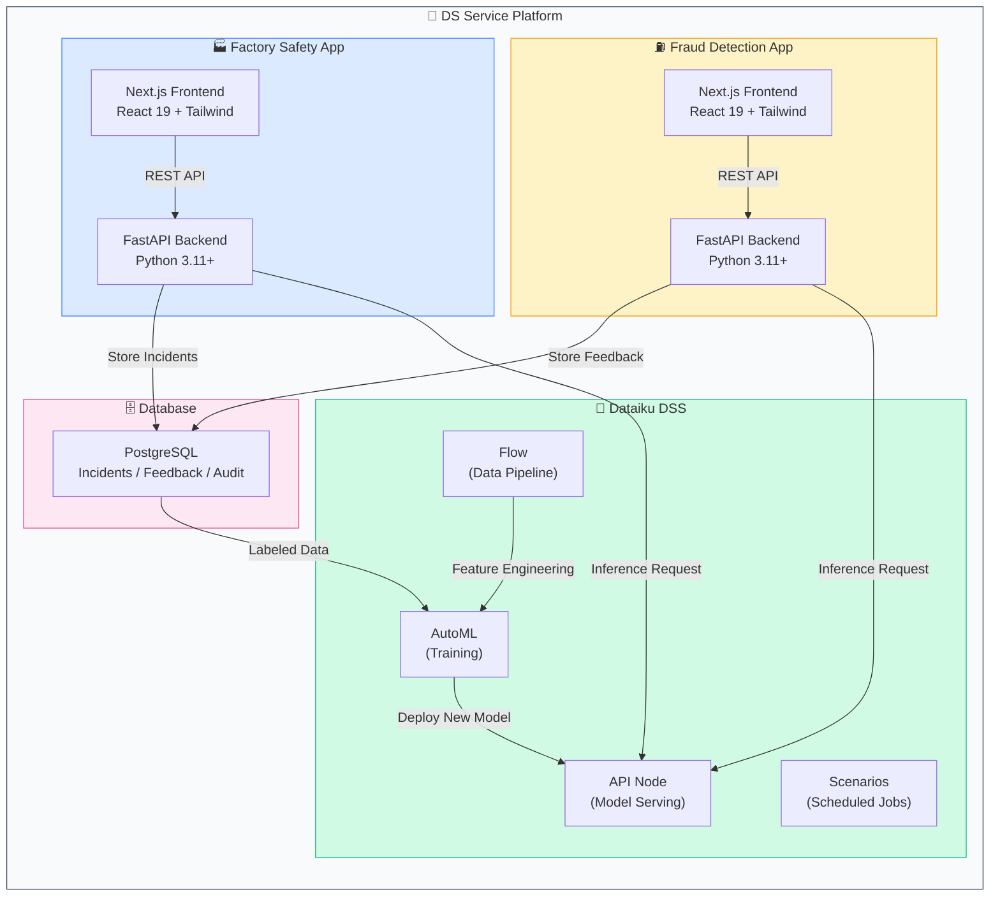

---

## 2. Factory Safety — High-Level Flow

### 2a. End-to-End Flow: ภาพเข้า → ตรวจจับ → แจ้งเตือน

```mermaid
graph LR
    A["📷 ถ่ายภาพ<br/>Operator / CCTV"] -->|Upload Image| B["🖥️ Next.js<br/>Frontend"]
    B -->|POST /detection/analyze<br/>FormData| C["⚙️ FastAPI<br/>Backend"]
    C -->|POST /predict<br/>image_b64| D["🧠 Dataiku<br/>YOLO Model"]
    D -->|detections[]<br/>bounding boxes<br/>confidence scores| C
    C -->|คำนวณ<br/>compliance_rate<br/>violations_count| E["📊 Dashboard<br/>แสดงผล + แจ้งเตือน"]

    style A fill:#dbeafe,stroke:#3b82f6
    style B fill:#e0e7ff,stroke:#6366f1
    style C fill:#fef3c7,stroke:#f59e0b
    style D fill:#d1fae5,stroke:#10b981
    style E fill:#fce7f3,stroke:#ec4899
```

### 2b. Detection Flow — Sequence Diagram

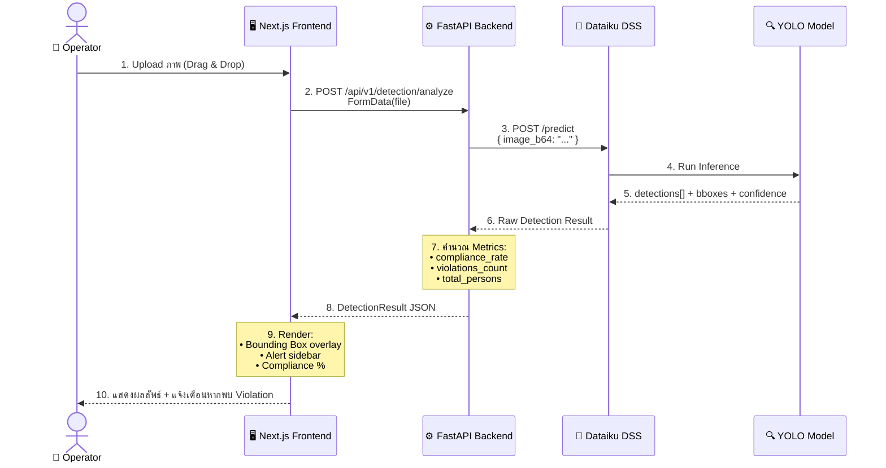

### 2c. สิ่งที่ Model ตรวจจับได้

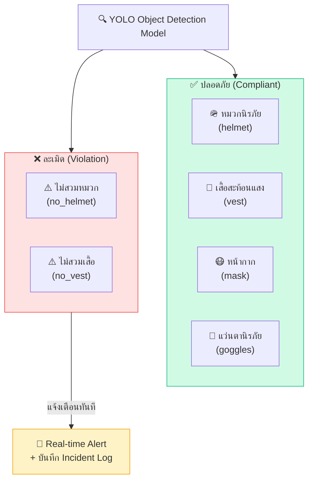

### 2d. Detection Result Schema

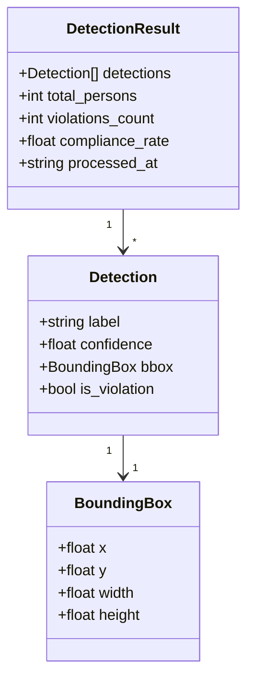

### 2e. Page Flow — User Journey

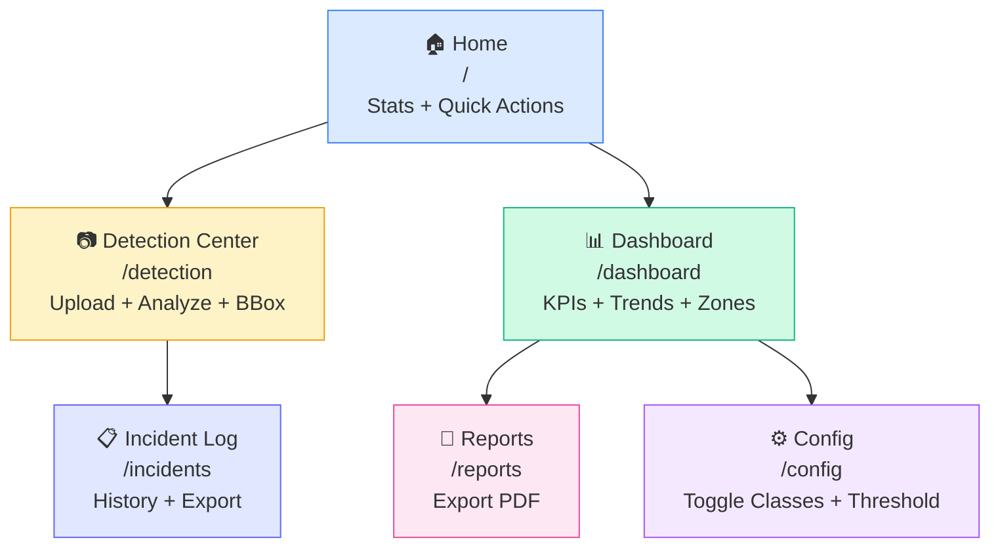

---

## 3. Fraud Detection — High-Level Flow

### 3a. End-to-End Flow: ข้อมูลเข้า → วิเคราะห์ → สอบสวน → เรียนรู้

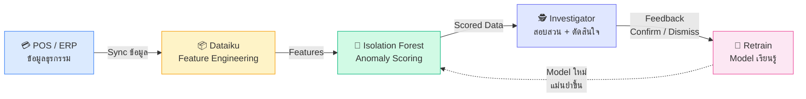

### 3b. Flow 1 — Data Ingestion & Batch Scoring

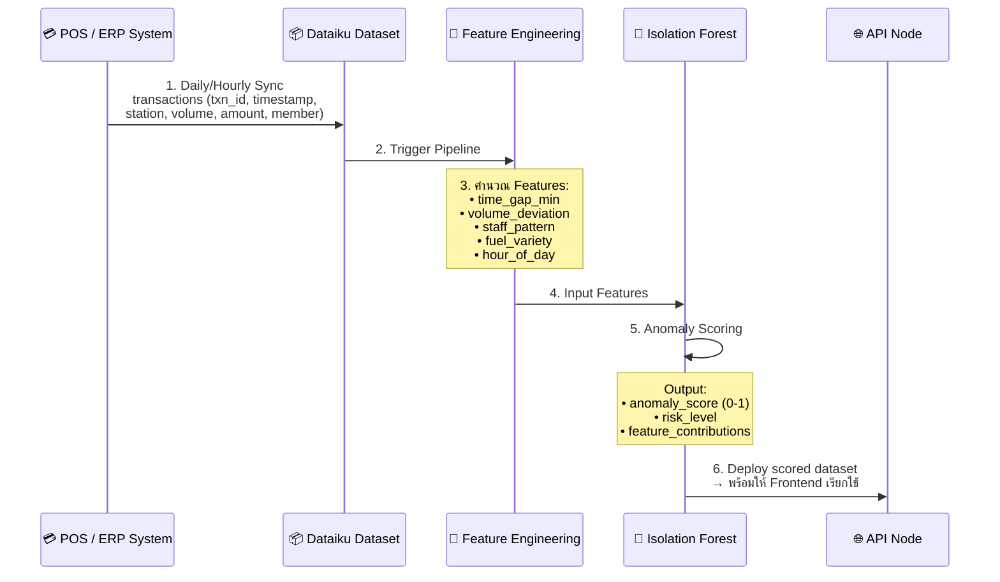

### 3c. Flow 2 — Investigation & Decision

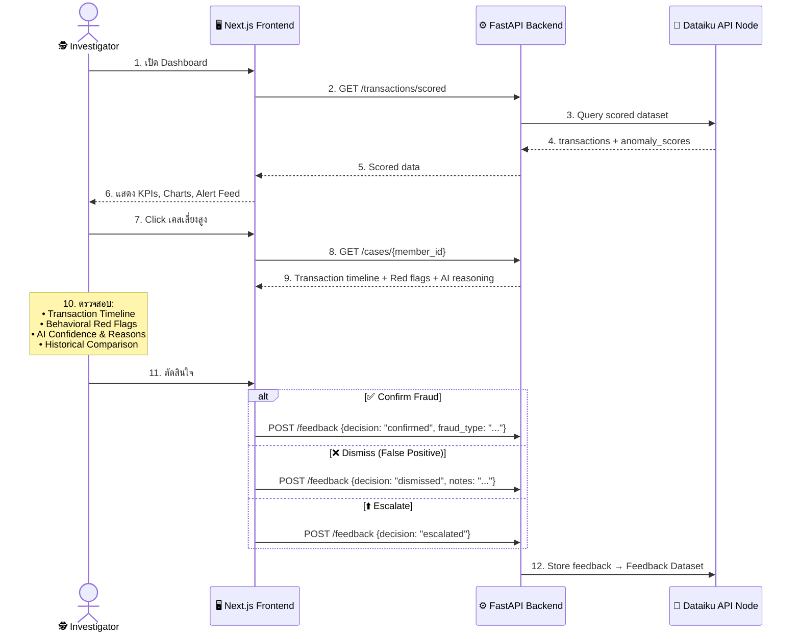

### 3d. Flow 3 — Model Retrain Loop

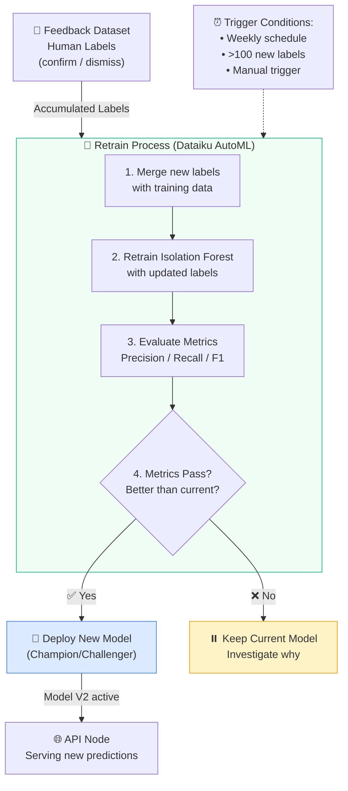

### 3e. Features ที่ Model ใช้วิเคราะห์

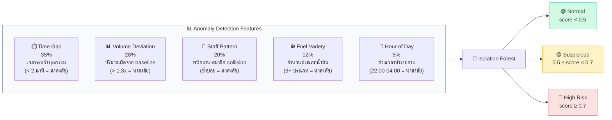

### 3f. Page Flow — Investigator Journey

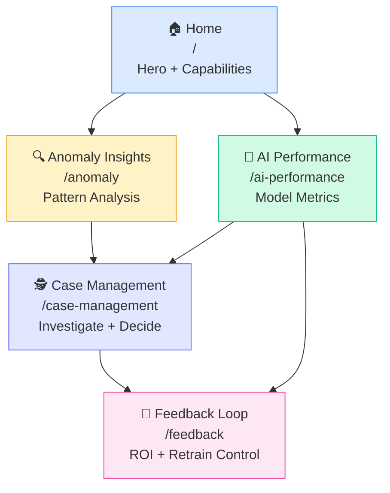

---

## 4. เปรียบเทียบ 2 Apps

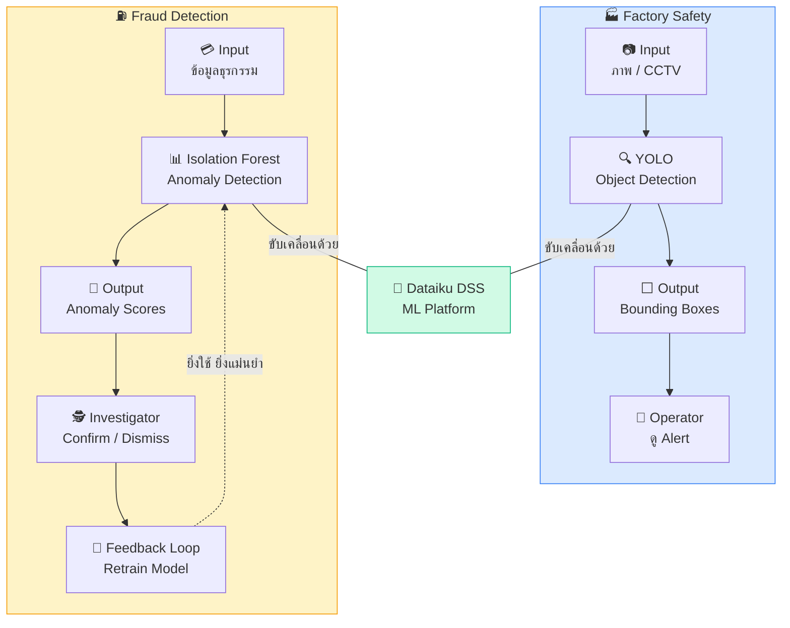

| Aspect | Factory Safety | Fraud Detection |
|--------|---------------|-----------------|
| **ML Task** | Object Detection (YOLO) | Anomaly Detection (Isolation Forest) |
| **Input** | ภาพ / CCTV | ข้อมูลธุรกรรม (POS) |
| **Inference** | Real-time per image | Batch scoring + real-time alert |
| **Output** | Bounding boxes + labels | Anomaly scores + risk levels |
| **User** | 👷 Operator | 🕵️ Investigator |
| **Feedback Loop** | ❌ ไม่มี | ✅ Retrain จาก human feedback |

---

## 5. Deployment Architecture

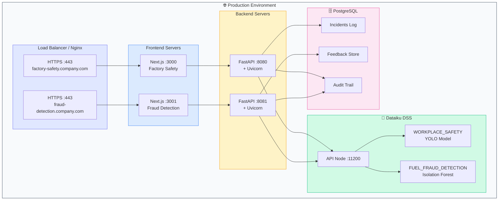

---

## 6. Dataiku Integration — API Config

### Factory Safety

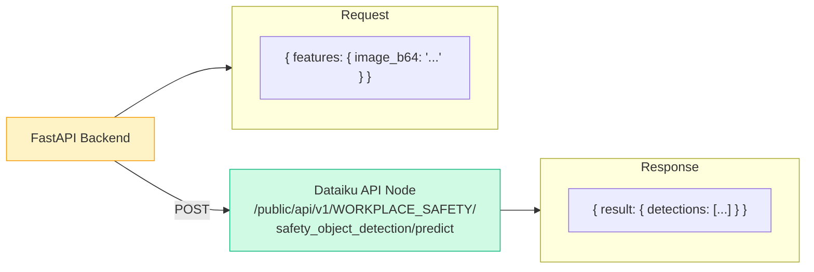

### Fraud Detection — Dataiku Flow

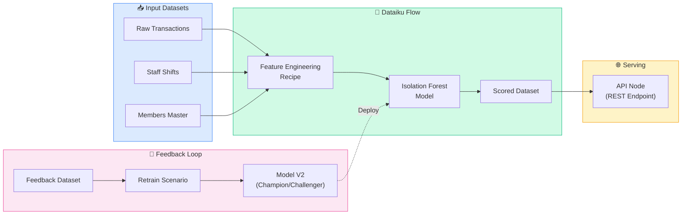
